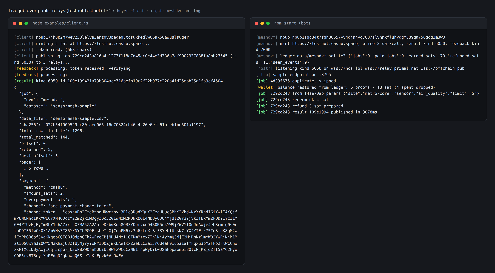
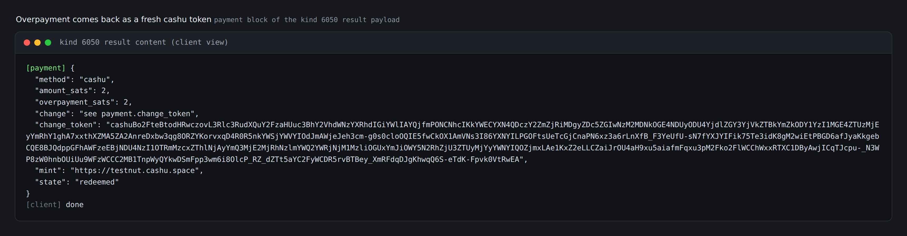
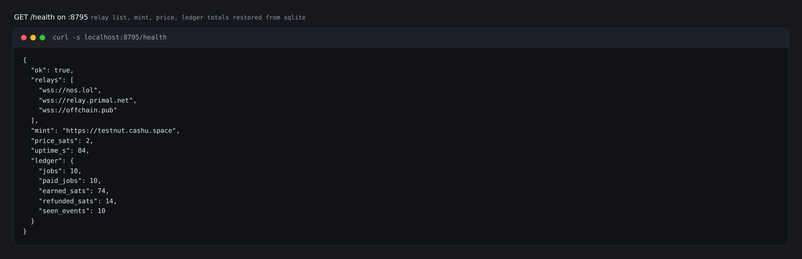

# meshdvm

A Nostr Data Vending Machine (NIP-90) that sells [SensorMesh](https://github.com/jayjex/sensormesh) IoT sensor data and takes Cashu ecash. No accounts on either side: the buyer is an npub, the payment is a token string pasted into a Nostr event.

Built for the Bitshala BOSS Battle hackathon, Freedom Stack track (Nostr + ecash).

## How it works

1. **Request.** The buyer publishes a NIP-90 job request (kind `5050`) with query params in `param` tags (`site`, `sensor`, `device`, `since`, `until`, `anomaly`, `limit`, `offset`, `stats`) and a `bid` budget in msat.
2. **Escrow.** The bot replies with kind `7000` feedback. Unpaid jobs get `payment_required` with the price and mint; paid jobs get `processing` while the attached Cashu token is checked against the mint (NUT-07 checkstate) and swapped into the bot's keyset. Spent tokens and foreign mints are rejected before any data moves.
3. **Query.** A paid job runs through the vendored SensorMesh engine: filter by site/sensor/device/time/anomaly, paginate, and pin the answer to the dataset SHA-256.
4. **Result.** The bot publishes kind `6050` with the rows as JSON content and a `request` tag echoing the job id.
5. **Refund.** Overpayment goes back to the buyer as a fresh Cashu token in the result payload (`payment.change_token`). Below 2 sat the change stays a tip: the keyset fee makes smaller tokens unredeemable. Every job, payment, refund, and processed event id is written to a SQLite ledger, so a restart re-restores the wallet balance and replays can't re-redeem a token.

Ask for a quote without paying, with noscl-style publishing (any NIP-90 client works):

```sh
noscl event -k 5050 --tag param=site:metro-core --tag param=limit:5 --tag bid=2000
# -> kind 7000 feedback: status=payment_required, price 2 sat at https://testnut.cashu.space
```

Mint a token at the testnet mint, then resend the job with it in a `cashu` tag (or content `{"cashu":"cashu..."}`):

```sh
noscl event -k 5050 --tag param=site:metro-core --tag param=limit:5 --tag bid=5000 \
  --tag cashu=cashuBo2FteBt...
# -> kind 7000 processing -> kind 6050 result (data JSON + payment.change_token when overpaid)
```

Or run the bundled client, which mints, publishes, waits, and prints the result:

```sh
node examples/client.js           # mint 5 sat testnet, buy one query, print the change token
node examples/client.js --no-pay  # unpaid request, expect payment_required feedback
```

One job end to end on public relays: the client (left) mints 5 sat, publishes kind 5050, and receives the kind 6050 result; the bot (right) restores its wallet from the ledger at boot, redeems, and refunds the change.



Or run the bundled client, which mints, publishes, waits, and prints the result:

```sh
node examples/client.js           # mint 5 sat testnet, buy one query, print the change token
node examples/client.js --no-pay  # unpaid request, expect payment_required feedback
node examples/client.js --p2pk <dvm-hex-pubkey>  # lock the payment NUT-11 P2PK to the DVM key
```

## P2PK: payments only the DVM can redeem

Anyone who sees a plain Cashu token in a public Nostr event can redeem it first. With a NUT-11 P2PK lock the token's proofs carry a spending condition: they only move when signed by the lock key. Mint the payment locked to the DVM's pubkey and an interceptor who grabs the job event holds a string they can't spend.

The bot derives the lock key from its own Nostr key, so the DVM identity is the same on Nostr and over ecash. It prints the hex at boot:

```
[meshdvm] p2pk lock pubkey 80307aaf... (NUT-11: lock buyer payments to this hex)
```

and repeats it in every `payment_required` feedback for clients that want to lock. Locked and unlocked payments both work; the result's `payment` block reports which one arrived:

```json
"payment": { "method": "cashu", "p2pk_locked": true, "p2pk_pubkey": "80307aaf...", ... }
```

A token locked to some other key is rejected with the lock key named, before any swap is attempted. testnut advertises NUT-11 support, so the full lock → sign-witness → swap loop runs live.

## Refunds and restart safety

Pay 5 sat for a 2 sat query and the result carries this block:



The token in `payment.change_token` is a normal Cashu token: paste it into any Cashu wallet to redeem the 2 sat. The refund split comes off the bot's own balance, and the keep side of every swap is written to the ledger, so after a crash or restart the bot rebuilds exactly what it still owns (spent proofs are dropped by asking the mint).



## Quick start

```sh
npm install
npm test          # 64 tests (smoke + hardening + rehydration + p2pk + edge), no network
npm start         # bot on nos.lol / relay.primal.net / offchain.pub / nostr.wine / relay.snort.social + HTTP :8795
```

Config via env (or a `.env` file, loaded with `--env-file-if-exists`):

| Var | Default | What |
| --- | --- | --- |
| `MESH_NSEC` | ephemeral key | Nostr key of the DVM. Save it if you want the same npub across restarts. |
| `MESH_P2PK_PRIVKEY` | derived from `MESH_NSEC` | Hex private key behind the P2PK lock. Default keeps one identity for Nostr and ecash. |
| `MESH_MINT_URL` | `https://testnut.cashu.space` | Cashu mint to accept tokens from |
| `MESH_RELAYS` | `wss://nos.lol,wss://relay.primal.net,wss://offchain.pub,wss://nostr.wine,wss://relay.snort.social` | Comma-separated relay list |
| `MESH_PRICE_SATS` | `2` | Price per query call in sats (mint swap fee is 1 sat, so 2 is the smallest redeemable payment) |
| `MESH_HTTP_PORT` | `8795` | Port for the sample endpoint |
| `MESH_DB` | `data/meshdvm.sqlite3` | SQLite ledger file (jobs, payments, refunds, seen event ids) |

## Free sample

`GET /v1/sensormesh/sample?limit=20` returns the first page of rows plus the dataset hash. `GET /health` shows relay list, mint, price, and ledger totals (jobs, sats earned, sats refunded).

## Status

Working: request parsing, feedback, token verify + redeem, NUT-11 P2PK-locked payments (lock check on accept, witness signing on redeem), overpayment change refunds, wallet balance rehydration after restart, SQLite ledger (restart-safe, event dedup), filtered queries with sha256 pinning, free sample endpoint, 5-relay subscription.

The DVM npub: `npub1sqc84t7fgh86557yv4djnhvg7037zlvnnxfluhydgmu89qa756gqg3m3w0` (key lives in a local `.env`, never committed).

Try it yourself while the bot is running:

```sh
MESH_DVM_PUBKEY=<bot hex pubkey> node examples/client.js
```

Set `MESH_DVM_PUBKEY` in your env to the DVM hex pubkey so the client ignores result events from other DVMs on the same relays (several free DVMs answer any kind 5050 they see).

Not yet (sprint 5+): multi-mint.

## License

MIT
